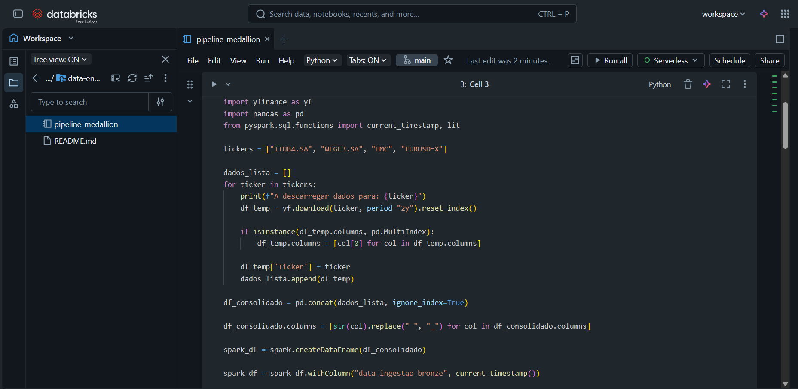
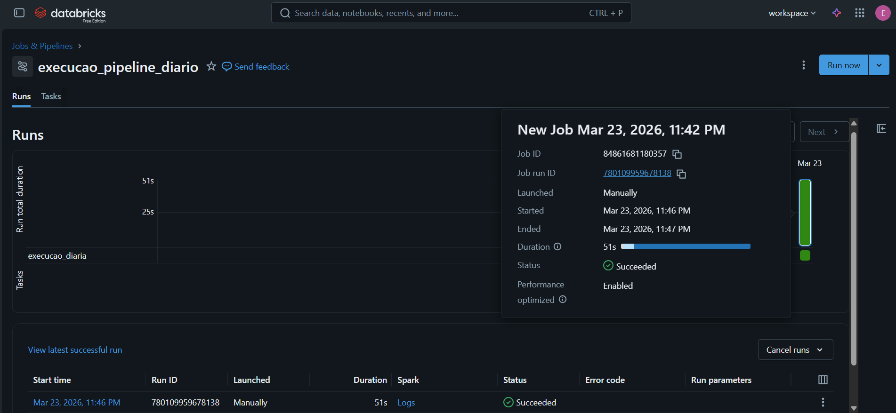
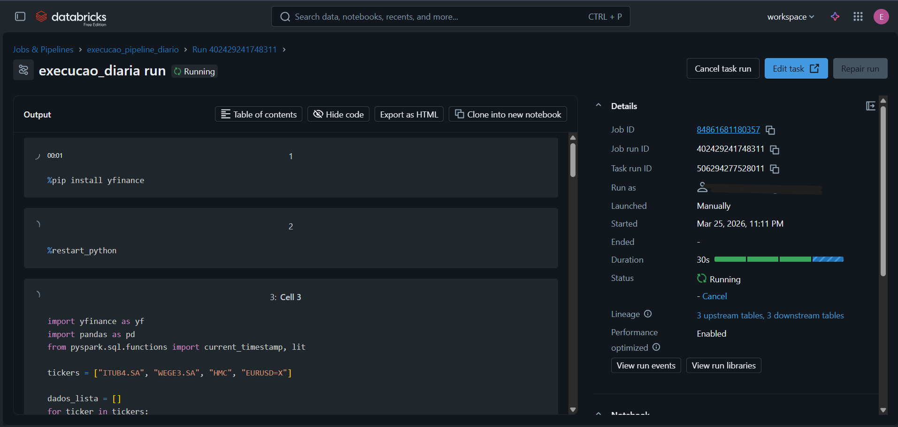

# 📈 Pipeline de Dados Financeiros: Arquitetura Medallion no Databricks

Este projeto demonstra a construção de um pipeline de dados ponta a ponta (ETL/ELT) utilizando o ecossistema **Databricks**, aplicando as melhores práticas da **Arquitetura Medallion** (Bronze, Silver e Gold) e formato **Delta Lake**.

O objetivo de negócio é extrair, limpar e modelar dados do mercado financeiro (ações e paridade de moedas) para dar suporte a dashboards de Business Intelligence (BI), auxiliando na tomada de decisão e projeção de metas financeiras de médio e longo prazo.

## 🛠️ Tecnologias e Ferramentas Utilizadas
* **Ambiente & Orquestração:** Databricks (Serverless Jobs Compute, Workflows)
* **Linguagens:** Python (PySpark) e SQL
* **Armazenamento:** Delta Lake (Tabelas Gerenciadas pelo Unity Catalog/Hive Metastore)
* **Versionamento:** Git integrado nativamente ao Databricks (Repos)
* **Bibliotecas Python:** `yfinance`, `pandas`

## 🏗️ Arquitetura do Pipeline (Medallion)

O fluxo de dados foi dividido em três camadas lógicas, garantindo governança, qualidade e performance:

### 🥉 1. Camada Bronze (Ingestão Bruta)
* **O que faz:** Extração de dados históricos de ativos financeiros (ex: ITUB4, WEGE3, EUR/USD) via API utilizando Python.
* **Técnica:** Os dados são convertidos em Spark DataFrames e salvos no formato Delta "as-is" (como vieram da fonte), adicionando apenas um metadado de linhagem (`data_ingestao_bronze`).
* **Motivação:** Garantir um histórico imutável para reprocessamento sem necessidade de bater na API externa novamente.

### 🥈 2. Camada Silver (Limpeza e Qualidade)
* **O que faz:** Tratamento de dados utilizando **PySpark**.
* **Técnica:** * Padronização de nomes de colunas (snake_case).
  * Conversão (Casting) de tipos de dados (ex: `to_date`).
  * **Data Quality:** Remoção de duplicatas (`dropDuplicates`) e tratamento de valores nulos, além da exclusão de dias sem volume de negociação (feriados/finais de semana).

### 🥇 3. Camada Gold (Regras de Negócio e Agregação)
* **O que faz:** Modelagem final para consumo ágil por ferramentas de BI.
* **Técnica:** Utilização de **SQL Avançado** no Databricks.
  * Uso de **CTEs** para organização lógica da query.
  * Aplicação de **Window Functions** (`AVG OVER`, `LAG OVER`) para calcular métricas complexas de séries temporais, como **Média Móvel de 7 dias** e **Variação Percentual Diária**.
* **Performance:** Aplicação de comandos de otimização de leitura diretamente no Delta Lake (`OPTIMIZE ... ZORDER BY`), agrupando fisicamente os arquivos por `ticker` e `data` para reduzir custos de scan.

## ⏱️ Orquestração e Sustentação
O pipeline inteiro está orquestrado utilizando o **Databricks Workflows**. Uma *Task* agendada roda diariamente em um cluster **Serverless** dedicado ao Job, garantindo a entrega contínua dos dados atualizados nas tabelas Gold de forma autônoma e escalável.

---

